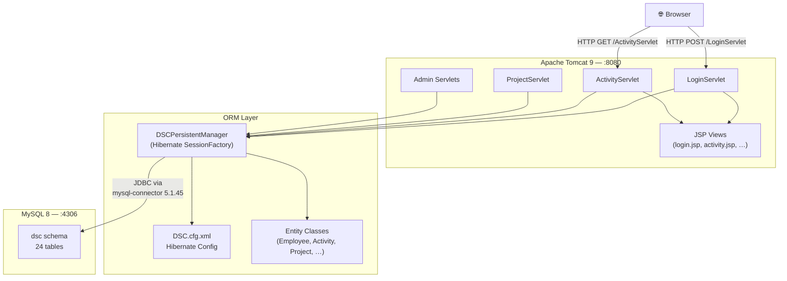
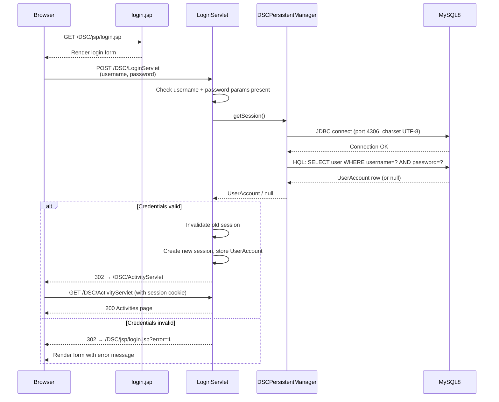
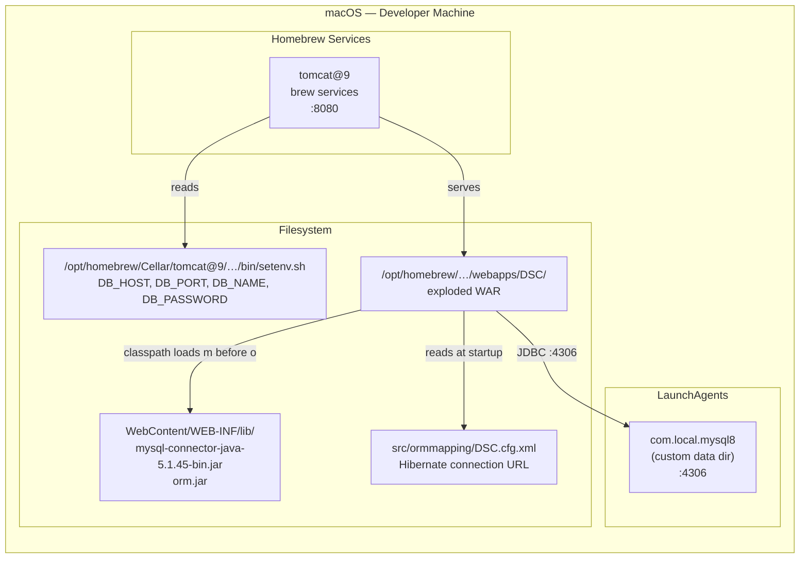

# Architecture Diagrams

Ryan Loiselle — Developer / Architect  
GitHub Copilot — AI pair programmer / code generation  
February 2026

AI-assisted: Mermaid diagram markup generated from codebase analysis;
reviewed and directed by Ryan Loiselle.

---

## 1. System Architecture

High-level component view — browser through servlet layer to ORM and database.

---

## 2. Login Authentication Flow

Sequence diagram showing the fixed credential-first login path (post commit `27c68c9`).

---

## 3. Local Deployment Topology

How the macOS development services are wired together.

---

## Diagram Inventory

Status against the required full UML suite (see `CODING_STANDARDS.md` §7).

| # | Diagram | UML Type | Perspective | Status |
|---|---------|----------|-------------|--------|
| 1 | System architecture | Component | Structural | ✅ Done (above) |
| 2 | Domain class model | Class | Structural | ⏳ Pending |
| 3 | Package / module organisation | Package | Structural | ⏳ Pending |
| 4 | Use case overview | Use Case | Behavioural | ⏳ Pending |
| 5 | Login sequence | Sequence | Behavioural | ✅ Done (above) |
| 5b | Time entry / activity sequence | Sequence | Behavioural | ⏳ Pending |
| 5c | Admin CRUD sequence | Sequence | Behavioural | ⏳ Pending |
| 6 | Authentication workflow | Activity | Behavioural | ⏳ Pending |
| 7 | Session lifecycle | State | Behavioural | ⏳ Pending |
| 8 | Entity-Relationship Diagram (ERD) | ERD | Data | ⏳ Pending |
| 9 | Physical schema (24 tables) | Schema | Data | ⏳ Pending |
| 10 | Local deployment topology | Deployment | Infrastructure | ✅ Done (above) |

Pending diagrams should be added incrementally as features are developed.
The ERD and class diagram are the highest priority — they document the
existing domain model before the modernisation effort begins.
