# Architecture Diagrams

Ryan Loiselle — Developer / Architect  
GitHub Copilot — AI pair programmer / code generation  
February 2026

AI-assisted: Mermaid diagram markup generated from codebase analysis;
reviewed and directed by Ryan Loiselle.

---

## 1. System Architecture

High-level component view — browser through servlet layer to ORM and database.

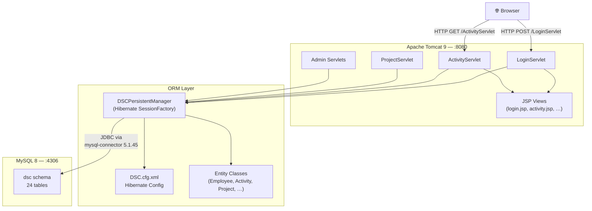

---

## 2. Login Authentication Flow

Sequence diagram showing the fixed credential-first login path (post commit `27c68c9`).

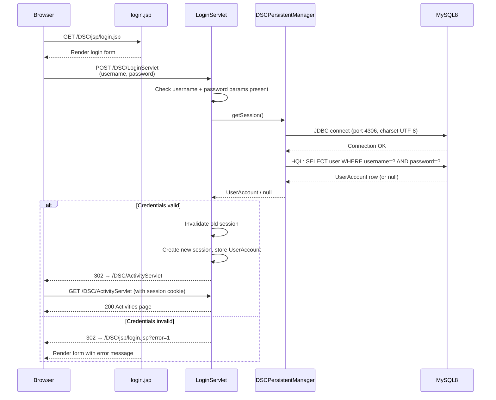

---

## 4. Domain Class Model

Core entities and their relationships as reflected by the ORM-generated classes.

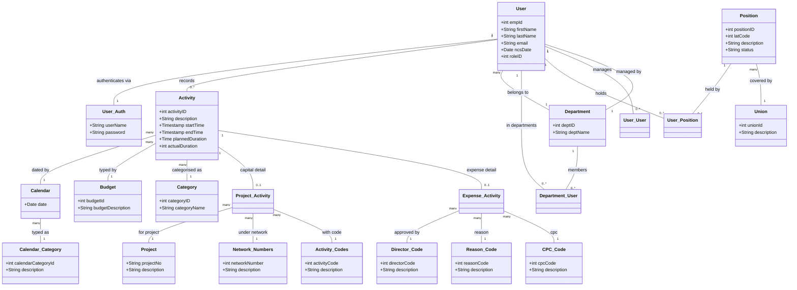

---

## 5. Package / Module Organisation

Source packages and their responsibilities.

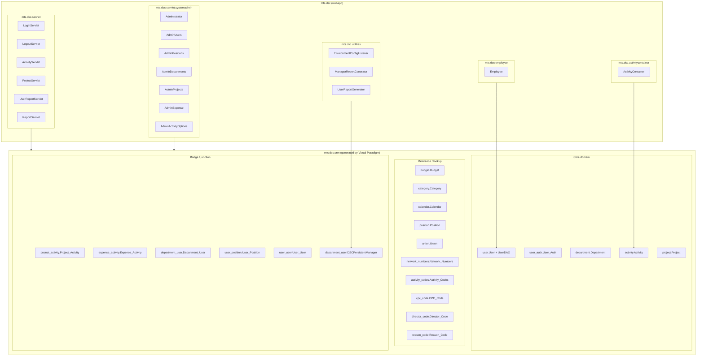

---

## 6. Use Case Overview

Primary actors and their available operations.

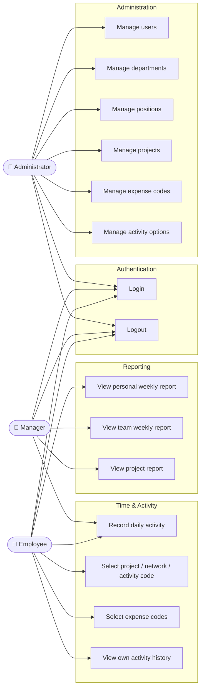

---

## 7. Activity Recording Sequence

Time entry flow: employee selects date, category, project details, and saves.

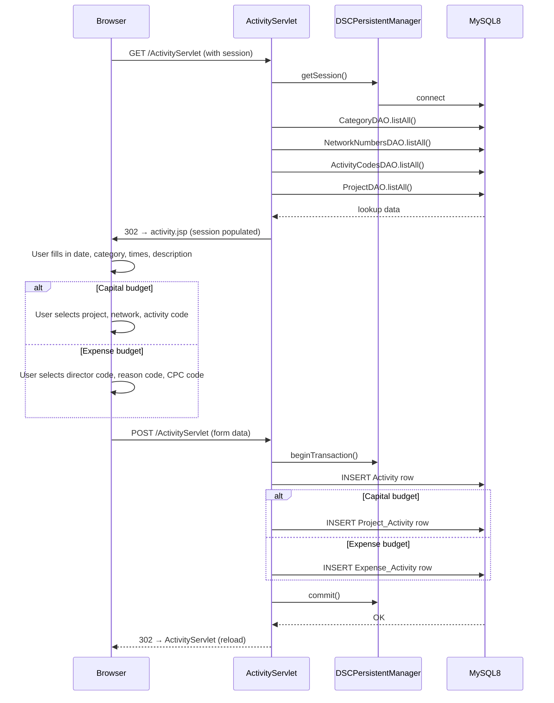

---

## 8. Admin CRUD Sequence

Representative flow for any admin entity (Users shown; Departments, Positions, Projects follow same pattern).

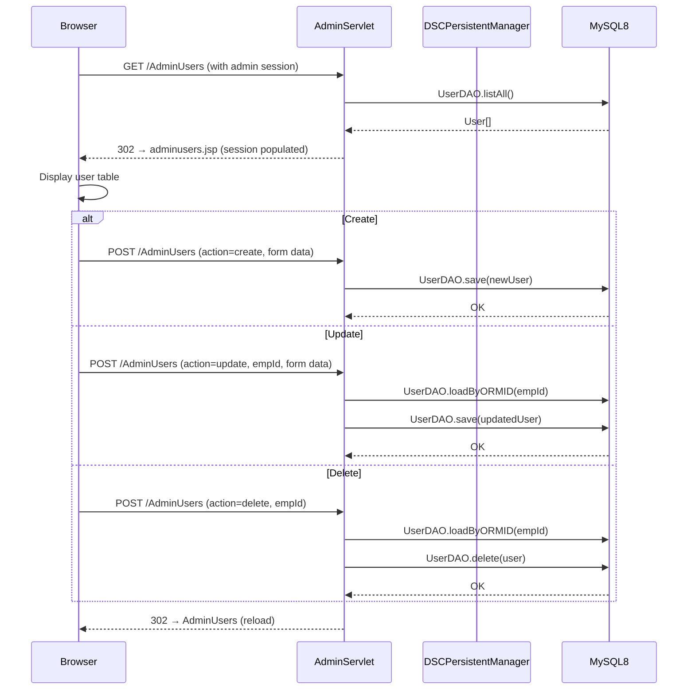

---

## 9. Authentication Workflow

Full decision tree from browser request to authorised session.

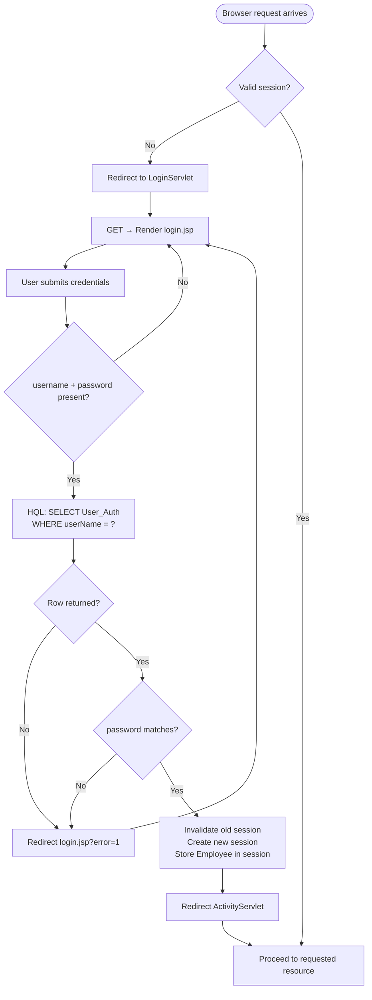

---

## 10. Session Lifecycle

States a user session moves through from first request to logout or expiry.

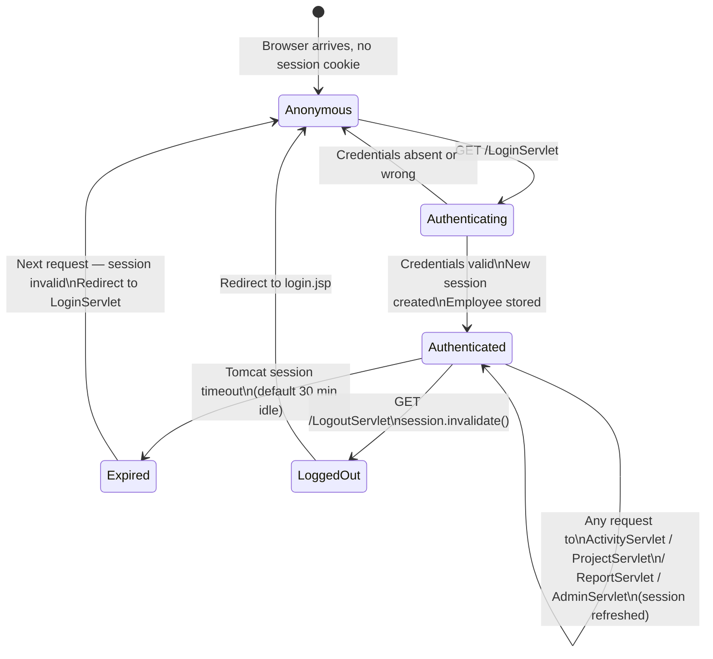

---

## 11. Entity-Relationship Diagram (ERD)

Logical data model — cardinalities and foreign-key relationships across all 19 tables.

```mermaid
erDiagram
    USER {
        int empId PK
        varchar firstName
        varchar lastName
        varchar email
        date ncsDate
        int roleID
        int deptID FK
    }
    USER_AUTH {
        varchar userName PK
        varchar password
        int empId FK
    }
    DEPARTMENT {
        int deptID PK
        varchar deptName
        int managerEmpId FK
    }
    DEPARTMENT_USER {
        int deptID FK
        int empId FK
    }
    USER_USER {
        int supervisorId FK
        int subordinateId FK
    }
    USER_POSITION {
        int empId FK
        int positionID FK
    }
    POSITION {
        int positionID PK
        int latCode
        varchar description
        varchar status
        int unionId FK
    }
    UNION {
        int unionId PK
        varchar description
    }
    ACTIVITY {
        int activityID PK
        date calendarDate FK
        varchar description
        timestamp startTime
        timestamp endTime
        time plannedDuration
        int actualDuration
        int empId FK
        int budgetId FK
        int categoryID FK
    }
    CALENDAR {
        date date PK
        int calendarCategoryId FK
    }
    CALENDAR_CATEGORY {
        int calendarCategoryId PK
        varchar description
    }
    BUDGET {
        int budgetId PK
        varchar budgetDescription
    }
    CATEGORY {
        int categoryID PK
        varchar categoryName
    }
    PROJECT_ACTIVITY {
        int activityID PK
        varchar projectNo FK
        int networkNumber FK
        int activityCode FK
    }
    PROJECT {
        varchar projectNo PK
        varchar description
    }
    NETWORK_NUMBERS {
        int networkNumber PK
        varchar description
    }
    ACTIVITY_CODES {
        int activityCode PK
        varchar description
    }
    EXPENSE_ACTIVITY {
        int activityID PK
        int directorCode FK
        int reasonCode FK
        int cpcCode FK
    }
    DIRECTOR_CODE {
        int directorCode PK
        varchar description
    }
    REASON_CODE {
        int reasonCode PK
        varchar description
    }
    CPC_CODE {
        int cpcCode PK
        varchar description
    }

    USER ||--|| USER_AUTH : "authenticated by"
    USER }o--|| DEPARTMENT : "primary dept"
    DEPARTMENT }o--o| USER : "managed by"
    DEPARTMENT ||--o{ DEPARTMENT_USER : "has members"
    USER ||--o{ DEPARTMENT_USER : "in depts"
    USER ||--o{ USER_POSITION : "holds"
    POSITION ||--o{ USER_POSITION : "held by"
    POSITION }o--|| UNION : "covered by"
    USER ||--o{ USER_USER : "supervises"
    USER ||--o{ ACTIVITY : "records"
    ACTIVITY }o--|| CALENDAR : "on date"
    CALENDAR }o--|| CALENDAR_CATEGORY : "typed as"
    ACTIVITY }o--|| BUDGET : "budget type"
    ACTIVITY }o--|| CATEGORY : "category"
    ACTIVITY ||--o| PROJECT_ACTIVITY : "capital detail"
    ACTIVITY ||--o| EXPENSE_ACTIVITY : "expense detail"
    PROJECT_ACTIVITY }o--|| PROJECT : "for project"
    PROJECT_ACTIVITY }o--|| NETWORK_NUMBERS : "network"
    PROJECT_ACTIVITY }o--|| ACTIVITY_CODES : "code"
    EXPENSE_ACTIVITY }o--|| DIRECTOR_CODE : "director"
    EXPENSE_ACTIVITY }o--|| REASON_CODE : "reason"
    EXPENSE_ACTIVITY }o--|| CPC_CODE : "cpc"
```

---

## 12. Physical Schema

Key table structure with data types (as deployed in MySQL 8, `dsc` schema).

| Table | Column | Type | Constraints |
|-------|--------|------|-------------|
| `user` | empId | INT | PK, AUTO_INCREMENT |
| | firstName | VARCHAR(50) | NOT NULL |
| | lastName | VARCHAR(50) | NOT NULL |
| | email | VARCHAR(100) | |
| | ncsDate | DATE | |
| | roleID | INT | NOT NULL |
| | deptID | INT | FK → department.deptID |
| `user_auth` | userName | VARCHAR(50) | PK |
| | password | VARCHAR(100) | NOT NULL — **plaintext; must be hashed** |
| | empId | INT | FK → user.empId |
| `department` | deptID | INT | PK, AUTO_INCREMENT |
| | deptName | VARCHAR(100) | NOT NULL |
| | managerEmpId | INT | FK → user.empId |
| `activity` | activityID | INT | PK, AUTO_INCREMENT |
| | calendarDate | DATE | FK → calendar.date |
| | description | TEXT | |
| | startTime | TIMESTAMP | |
| | endTime | TIMESTAMP | |
| | plannedDuration | TIME | |
| | actualDuration | INT | minutes |
| | empId | INT | FK → user.empId |
| | budgetId | INT | FK → budget.budgetId |
| | categoryID | INT | FK → category.categoryID |
| `project_activity` | activityID | INT | PK, FK → activity |
| | projectNo | VARCHAR(20) | FK → project |
| | networkNumber | INT | FK → network_numbers |
| | activityCode | INT | FK → activity_codes |
| `expense_activity` | activityID | INT | PK, FK → activity |
| | directorCode | INT | FK → director_code |
| | reasonCode | INT | FK → reason_code |
| | cpcCode | INT | FK → cpc_code |
| `position` | positionID | INT | PK |
| | latCode | INT | |
| | description | VARCHAR(100) | |
| | status | VARCHAR(20) | |
| | unionId | INT | FK → union |
| `calendar` | date | DATE | PK |
| | calendarCategoryId | INT | FK → calendar_category |
| `budget` | budgetId | INT | PK |
| | budgetDescription | VARCHAR(100) | |
| `category` | categoryID | INT | PK |
| | categoryName | VARCHAR(100) | |

> Junction tables `department_user`, `user_position`, `user_user` each use composite PK from their FK columns.
> Lookup tables (`union`, `network_numbers`, `activity_codes`, `cpc_code`, `director_code`, `reason_code`, `calendar_category`) follow the same pattern: INT PK + VARCHAR description.

---

## 3. Local Deployment Topology

How the macOS development services are wired together.

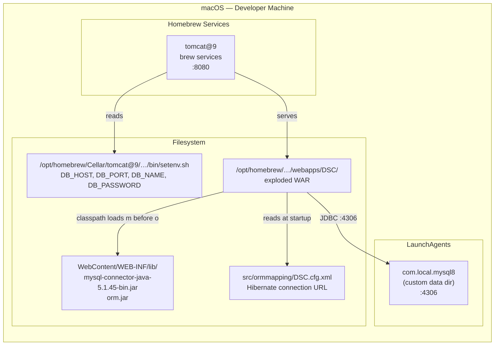

---

## Diagram Inventory

Status against the required full UML suite (see `CODING_STANDARDS.md` §7).

| # | Diagram | UML Type | Perspective | Status |
|---|---------|----------|-------------|--------|
| 1 | System architecture | Component | Structural | ✅ Done |
| 2 | Login sequence | Sequence | Behavioural | ✅ Done |
| 3 | Local deployment topology | Deployment | Infrastructure | ✅ Done |
| 4 | Domain class model | Class | Structural | ✅ Done |
| 5 | Package / module organisation | Package | Structural | ✅ Done |
| 6 | Use case overview | Use Case | Behavioural | ✅ Done |
| 7 | Activity recording sequence | Sequence | Behavioural | ✅ Done |
| 8 | Admin CRUD sequence | Sequence | Behavioural | ✅ Done |
| 9 | Authentication workflow | Activity | Behavioural | ✅ Done |
| 10 | Session lifecycle | State | Behavioural | ✅ Done |
| 11 | Entity-Relationship Diagram (ERD) | ERD | Data | ✅ Done |
| 12 | Physical schema | Schema | Data | ✅ Done |

All 12 diagrams complete as of Session 5. Update this table when new diagrams are
added or revised during the modernisation effort.
