# Architecture Diagrams

Ryan Loiselle — Developer / Architect  
GitHub Copilot — AI pair programmer / code generation  
February 2026

AI-assisted: Mermaid diagram markup generated from codebase analysis;
reviewed and directed by Ryan Loiselle.

---

## 1. System Architecture

High-level component view — browser through servlet layer to ORM and database.

```mermaid
graph TD
    Browser["🌐 Browser"]

    subgraph Tomcat9["Apache Tomcat 9 — :8080"]
        Login["LoginServlet"]
        Activity["ActivityServlet"]
        Project["ProjectServlet"]
        Admin["Admin Servlets"]
        JSP["JSP Views\n(login.jsp, activity.jsp, …)"]
    end

    subgraph ORM["ORM Layer"]
        PM["DSCPersistentManager\n(Hibernate SessionFactory)"]
        CFG["DSC.cfg.xml\nHibernate Config"]
        Entities["Entity Classes\n(Employee, Activity, Project, …)"]
    end

    subgraph DB["MySQL 8 — :4306"]
        Schema["dsc schema\n24 tables"]
    end

    Browser -->|"HTTP POST /LoginServlet"| Login
    Browser -->|"HTTP GET /ActivityServlet"| Activity
    Login --> PM
    Activity --> PM
    Project --> PM
    Admin --> PM
    PM --> CFG
    PM --> Entities
    PM -->|"JDBC via\nmysql-connector 5.1.45"| Schema
    Login --> JSP
    Activity --> JSP
```

---

## 2. Login Authentication Flow

Sequence diagram showing the fixed credential-first login path (post commit `27c68c9`).

---

## 3. Local Deployment Topology

How the macOS development services are wired together.

```mermaid
graph LR
    subgraph macOS["macOS — Developer Machine"]
        subgraph Homebrew["Homebrew Services"]
            Tomcat["tomcat@9\nbrew services\n:8080"]
        end

        subgraph LaunchAgent["LaunchAgents"]
            MySQL8["com.local.mysql8\n(custom data dir)\n:4306"]
        end

        subgraph Filesystem["Filesystem"]
            SetEnv["/opt/homebrew/Cellar/tomcat@9/…/bin/setenv.sh\nDB_HOST, DB_PORT, DB_NAME, DB_PASSWORD"]
            DSCCfg["src/ormmapping/DSC.cfg.xml\nHibernate connection URL"]
            WLIB["WebContent/WEB-INF/lib/\nmysql-connector-java-5.1.45-bin.jar\norm.jar"]
            WebApp["/opt/homebrew/…/webapps/DSC/\nexploded WAR"]
        end
    end

    Tomcat -->|reads| SetEnv
    Tomcat -->|serves| WebApp
    WebApp -->|classpath loads m before o| WLIB
    WebApp -->|reads at startup| DSCCfg
    WebApp -->|JDBC :4306| MySQL8
```

