# Architecture Diagrams

Ryan Loiselle — Developer / Architect  
GitHub Copilot — AI pair programmer / code generation  
February 2026

AI-assisted: Mermaid diagram markup generated from codebase analysis;
reviewed and directed by Ryan Loiselle.

---

## 1. System Architecture

High-level component view — browser through servlet layer to ORM and database.

```mermaid
graph TD
    Browser["🌐 Browser"]

    subgraph Tomcat9["Apache Tomcat 9 — :8080"]
        Login["LoginServlet"]
        Activity["ActivityServlet"]
        Project["ProjectServlet"]
        Admin["Admin Servlets"]
        JSP["JSP Views\n(login.jsp, activity.jsp, …)"]
    end

    subgraph ORM["ORM Layer"]
        PM["DSCPersistentManager\n(Hibernate SessionFactory)"]
        CFG["DSC.cfg.xml\nHibernate Config"]
        Entities["Entity Classes\n(Employee, Activity, Project, …)"]
    end

    subgraph DB["MySQL 8 — :4306"]
        Schema["dsc schema\n24 tables"]
    end

    Browser -->|"HTTP POST /LoginServlet"| Login
    Browser -->|"HTTP GET /ActivityServlet"| Activity
    Login --> PM
    Activity --> PM
    Project --> PM
    Admin --> PM
    PM --> CFG
    PM --> Entities
    PM -->|"JDBC via\nmysql-connector 5.1.45"| Schema
    Login --> JSP
    Activity --> JSP
```

---

## 2. Login Authentication Flow

Sequence diagram showing the fixed credential-first login path (post commit `27c68c9`).

---

## 4. Domain Class Model

Core entities and their relationships as reflected by the ORM-generated classes.

---

## 5. Package / Module Organisation

Source packages and their responsibilities.

---

## 6. Use Case Overview

Primary actors and their available operations.

```mermaid
graph LR
    Employee(["👤 Employee"])
    Manager(["👤 Manager"])
    Admin(["👤 Administrator"])

    subgraph auth["Authentication"]
        UC1[Login]
        UC2[Logout]
    end
    subgraph timeentry["Time & Activity"]
        UC3[Record daily activity]
        UC4[Select project / network / activity code]
        UC5[Select expense codes]
        UC6[View own activity history]
    end
    subgraph reporting["Reporting"]
        UC7[View personal weekly report]
        UC8[View team weekly report]
        UC9[View project report]
    end
    subgraph admin_uc["Administration"]
        UC10[Manage users]
        UC11[Manage departments]
        UC12[Manage positions]
        UC13[Manage projects]
        UC14[Manage expense codes]
        UC15[Manage activity options]
    end

    Employee --> UC1
    Employee --> UC2
    Employee --> UC3
    Employee --> UC4
    Employee --> UC5
    Employee --> UC6
    Employee --> UC7
    Manager --> UC1
    Manager --> UC2
    Manager --> UC3
    Manager --> UC8
    Manager --> UC9
    Admin --> UC1
    Admin --> UC2
    Admin --> UC10
    Admin --> UC11
    Admin --> UC12
    Admin --> UC13
    Admin --> UC14
    Admin --> UC15
```

---

## 7. Activity Recording Sequence

Time entry flow: employee selects date, category, project details, and saves.

```mermaid
sequenceDiagram
    participant Browser
    participant ActivityServlet
    participant DSCPersistentManager
    participant MySQL8

    Browser->>ActivityServlet: GET /ActivityServlet (with session)
    ActivityServlet->>DSCPersistentManager: getSession()
    DSCPersistentManager->>MySQL8: connect
    ActivityServlet->>MySQL8: CategoryDAO.listAll()
    ActivityServlet->>MySQL8: NetworkNumbersDAO.listAll()
    ActivityServlet->>MySQL8: ActivityCodesDAO.listAll()
    ActivityServlet->>MySQL8: ProjectDAO.listAll()
    MySQL8-->>ActivityServlet: lookup data
    ActivityServlet->>Browser: 302 → activity.jsp (session populated)

    Browser->>Browser: User fills in date, category, times, description

    alt Capital budget
        Browser->>Browser: User selects project, network, activity code
    else Expense budget
        Browser->>Browser: User selects director code, reason code, CPC code
    end

    Browser->>ActivityServlet: POST /ActivityServlet (form data)
    ActivityServlet->>DSCPersistentManager: beginTransaction()
    ActivityServlet->>MySQL8: INSERT Activity row
    alt Capital budget
        ActivityServlet->>MySQL8: INSERT Project_Activity row
    else Expense budget
        ActivityServlet->>MySQL8: INSERT Expense_Activity row
    end
    ActivityServlet->>DSCPersistentManager: commit()
    MySQL8-->>ActivityServlet: OK
    ActivityServlet-->>Browser: 302 → ActivityServlet (reload)
```

---

## 8. Admin CRUD Sequence

Representative flow for any admin entity (Users shown; Departments, Positions, Projects follow same pattern).

```mermaid
sequenceDiagram
    participant Browser
    participant AdminServlet
    participant DSCPersistentManager
    participant MySQL8

    Browser->>AdminServlet: GET /AdminUsers (with admin session)
    AdminServlet->>MySQL8: UserDAO.listAll()
    MySQL8-->>AdminServlet: User[]
    AdminServlet-->>Browser: 302 → adminusers.jsp (session populated)
    Browser->>Browser: Display user table

    alt Create
        Browser->>AdminServlet: POST /AdminUsers (action=create, form data)
        AdminServlet->>MySQL8: UserDAO.save(newUser)
        MySQL8-->>AdminServlet: OK
    else Update
        Browser->>AdminServlet: POST /AdminUsers (action=update, empId, form data)
        AdminServlet->>MySQL8: UserDAO.loadByORMID(empId)
        AdminServlet->>MySQL8: UserDAO.save(updatedUser)
        MySQL8-->>AdminServlet: OK
    else Delete
        Browser->>AdminServlet: POST /AdminUsers (action=delete, empId)
        AdminServlet->>MySQL8: UserDAO.loadByORMID(empId)
        AdminServlet->>MySQL8: UserDAO.delete(user)
        MySQL8-->>AdminServlet: OK
    end

    AdminServlet-->>Browser: 302 → AdminUsers (reload)
```

---

## 9. Authentication Workflow

Full decision tree from browser request to authorised session.

---

## 10. Session Lifecycle

States a user session moves through from first request to logout or expiry.

---

## 11. Entity-Relationship Diagram (ERD)

Logical data model — cardinalities and foreign-key relationships across all 19 tables.

```mermaid
erDiagram
    USER {
        int empId PK
        varchar firstName
        varchar lastName
        varchar email
        date ncsDate
        int roleID
        int deptID FK
    }
    USER_AUTH {
        varchar userName PK
        varchar password
        int empId FK
    }
    DEPARTMENT {
        int deptID PK
        varchar deptName
        int managerEmpId FK
    }
    DEPARTMENT_USER {
        int deptID FK
        int empId FK
    }
    USER_USER {
        int supervisorId FK
        int subordinateId FK
    }
    USER_POSITION {
        int empId FK
        int positionID FK
    }
    POSITION {
        int positionID PK
        int latCode
        varchar description
        varchar status
        int unionId FK
    }
    UNION {
        int unionId PK
        varchar description
    }
    ACTIVITY {
        int activityID PK
        date calendarDate FK
        varchar description
        timestamp startTime
        timestamp endTime
        time plannedDuration
        int actualDuration
        int empId FK
        int budgetId FK
        int categoryID FK
    }
    CALENDAR {
        date date PK
        int calendarCategoryId FK
    }
    CALENDAR_CATEGORY {
        int calendarCategoryId PK
        varchar description
    }
    BUDGET {
        int budgetId PK
        varchar budgetDescription
    }
    CATEGORY {
        int categoryID PK
        varchar categoryName
    }
    PROJECT_ACTIVITY {
        int activityID PK
        varchar projectNo FK
        int networkNumber FK
        int activityCode FK
    }
    PROJECT {
        varchar projectNo PK
        varchar description
    }
    NETWORK_NUMBERS {
        int networkNumber PK
        varchar description
    }
    ACTIVITY_CODES {
        int activityCode PK
        varchar description
    }
    EXPENSE_ACTIVITY {
        int activityID PK
        int directorCode FK
        int reasonCode FK
        int cpcCode FK
    }
    DIRECTOR_CODE {
        int directorCode PK
        varchar description
    }
    REASON_CODE {
        int reasonCode PK
        varchar description
    }
    CPC_CODE {
        int cpcCode PK
        varchar description
    }

    USER ||--|| USER_AUTH : "authenticated by"
    USER }o--|| DEPARTMENT : "primary dept"
    DEPARTMENT }o--o| USER : "managed by"
    DEPARTMENT ||--o{ DEPARTMENT_USER : "has members"
    USER ||--o{ DEPARTMENT_USER : "in depts"
    USER ||--o{ USER_POSITION : "holds"
    POSITION ||--o{ USER_POSITION : "held by"
    POSITION }o--|| UNION : "covered by"
    USER ||--o{ USER_USER : "supervises"
    USER ||--o{ ACTIVITY : "records"
    ACTIVITY }o--|| CALENDAR : "on date"
    CALENDAR }o--|| CALENDAR_CATEGORY : "typed as"
    ACTIVITY }o--|| BUDGET : "budget type"
    ACTIVITY }o--|| CATEGORY : "category"
    ACTIVITY ||--o| PROJECT_ACTIVITY : "capital detail"
    ACTIVITY ||--o| EXPENSE_ACTIVITY : "expense detail"
    PROJECT_ACTIVITY }o--|| PROJECT : "for project"
    PROJECT_ACTIVITY }o--|| NETWORK_NUMBERS : "network"
    PROJECT_ACTIVITY }o--|| ACTIVITY_CODES : "code"
    EXPENSE_ACTIVITY }o--|| DIRECTOR_CODE : "director"
    EXPENSE_ACTIVITY }o--|| REASON_CODE : "reason"
    EXPENSE_ACTIVITY }o--|| CPC_CODE : "cpc"
```

---

## 12. Physical Schema

Key table structure with data types (as deployed in MySQL 8, `dsc` schema).

| Table | Column | Type | Constraints |
|-------|--------|------|-------------|
| `user` | empId | INT | PK, AUTO_INCREMENT |
| | firstName | VARCHAR(50) | NOT NULL |
| | lastName | VARCHAR(50) | NOT NULL |
| | email | VARCHAR(100) | |
| | ncsDate | DATE | |
| | roleID | INT | NOT NULL |
| | deptID | INT | FK → department.deptID |
| `user_auth` | userName | VARCHAR(50) | PK |
| | password | VARCHAR(100) | NOT NULL — **plaintext; must be hashed** |
| | empId | INT | FK → user.empId |
| `department` | deptID | INT | PK, AUTO_INCREMENT |
| | deptName | VARCHAR(100) | NOT NULL |
| | managerEmpId | INT | FK → user.empId |
| `activity` | activityID | INT | PK, AUTO_INCREMENT |
| | calendarDate | DATE | FK → calendar.date |
| | description | TEXT | |
| | startTime | TIMESTAMP | |
| | endTime | TIMESTAMP | |
| | plannedDuration | TIME | |
| | actualDuration | INT | minutes |
| | empId | INT | FK → user.empId |
| | budgetId | INT | FK → budget.budgetId |
| | categoryID | INT | FK → category.categoryID |
| `project_activity` | activityID | INT | PK, FK → activity |
| | projectNo | VARCHAR(20) | FK → project |
| | networkNumber | INT | FK → network_numbers |
| | activityCode | INT | FK → activity_codes |
| `expense_activity` | activityID | INT | PK, FK → activity |
| | directorCode | INT | FK → director_code |
| | reasonCode | INT | FK → reason_code |
| | cpcCode | INT | FK → cpc_code |
| `position` | positionID | INT | PK |
| | latCode | INT | |
| | description | VARCHAR(100) | |
| | status | VARCHAR(20) | |
| | unionId | INT | FK → union |
| `calendar` | date | DATE | PK |
| | calendarCategoryId | INT | FK → calendar_category |
| `budget` | budgetId | INT | PK |
| | budgetDescription | VARCHAR(100) | |
| `category` | categoryID | INT | PK |
| | categoryName | VARCHAR(100) | |

> Junction tables `department_user`, `user_position`, `user_user` each use composite PK from their FK columns.
> Lookup tables (`union`, `network_numbers`, `activity_codes`, `cpc_code`, `director_code`, `reason_code`, `calendar_category`) follow the same pattern: INT PK + VARCHAR description.

---

## 3. Local Deployment Topology

How the macOS development services are wired together.

```mermaid
graph LR
    subgraph macOS["macOS — Developer Machine"]
        subgraph Homebrew["Homebrew Services"]
            Tomcat["tomcat@9\nbrew services\n:8080"]
        end

        subgraph LaunchAgent["LaunchAgents"]
            MySQL8["com.local.mysql8\n(custom data dir)\n:4306"]
        end

        subgraph Filesystem["Filesystem"]
            SetEnv["/opt/homebrew/Cellar/tomcat@9/…/bin/setenv.sh\nDB_HOST, DB_PORT, DB_NAME, DB_PASSWORD"]
            DSCCfg["src/ormmapping/DSC.cfg.xml\nHibernate connection URL"]
            WLIB["WebContent/WEB-INF/lib/\nmysql-connector-java-5.1.45-bin.jar\norm.jar"]
            WebApp["/opt/homebrew/…/webapps/DSC/\nexploded WAR"]
        end
    end

    Tomcat -->|reads| SetEnv
    Tomcat -->|serves| WebApp
    WebApp -->|classpath loads m before o| WLIB
    WebApp -->|reads at startup| DSCCfg
    WebApp -->|JDBC :4306| MySQL8
```

---

## Diagram Inventory

Status against the required full UML suite (see `CODING_STANDARDS.md` §7).

| # | Diagram | UML Type | Perspective | Status |
|---|---------|----------|-------------|--------|
| 1 | System architecture | Component | Structural | ✅ Done |
| 2 | Login sequence | Sequence | Behavioural | ✅ Done |
| 3 | Local deployment topology | Deployment | Infrastructure | ✅ Done |
| 4 | Domain class model | Class | Structural | ✅ Done |
| 5 | Package / module organisation | Package | Structural | ✅ Done |
| 6 | Use case overview | Use Case | Behavioural | ✅ Done |
| 7 | Activity recording sequence | Sequence | Behavioural | ✅ Done |
| 8 | Admin CRUD sequence | Sequence | Behavioural | ✅ Done |
| 9 | Authentication workflow | Activity | Behavioural | ✅ Done |
| 10 | Session lifecycle | State | Behavioural | ✅ Done |
| 11 | Entity-Relationship Diagram (ERD) | ERD | Data | ✅ Done |
| 12 | Physical schema | Schema | Data | ✅ Done |

All 12 diagrams complete as of Session 5. Update this table when new diagrams are
added or revised during the modernisation effort.
